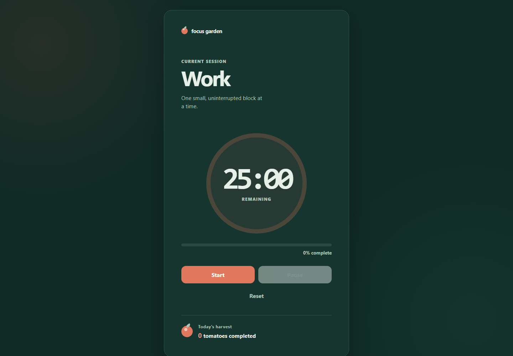
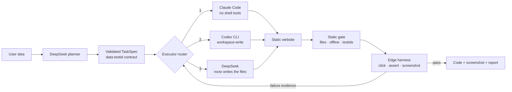

# Rainbow Octopus 🐙🌈

> A small engineering agent that turns one sentence into a **review-ready,
> automatically verified static web demo**.

Repository: <https://github.com/luminous-creator/Rainbow-Octopus>



<sub>`rocto build "做一个带统计功能的番茄钟网页"` — planned by DeepSeek, written by
the Codex backend after Claude Code was skipped for being signed out, then driven
in a headless browser: 31 assertions, [full report](demo-output/pomodoro-2/acceptance-report.json).
The whole run is kept in [`demo-output/pomodoro-2/`](demo-output/pomodoro-2/),
including [what that green report failed to catch](docs/KNOWN_ISSUES.md#ki-007--a-passing-contract-that-verified-almost-nothing--fixed).</sub>

Rainbow Octopus is not another general agent framework. It is a narrow,
observable workflow:

```text
idea → DeepSeek task specification → the first available coding agent
     → deterministic Chromium checks → repair (up to two times) → artifacts
```

The first release runs on Windows, macOS and Linux and deliberately supports
one task: creating a new vanilla HTML/CSS/JavaScript demo in an empty directory.

### Try it with no account, no CLI, no browser

The whole pipeline can be rehearsed offline. Two model calls are replaced by
fixed responses; the planner, the router, the executor boundary enforcement and
the static half of the verifier are all the real code:

```bash
git clone https://github.com/luminous-creator/Rainbow-Octopus
cd Rainbow-Octopus
python scripts/dry_run.py router
```

The `router` scenario simulates a signed-out Claude Code and a broken Codex, and
shows the failover picking DeepSeek. Takes about ten seconds and needs nothing
installed — the package has no third-party dependencies.

## Why this exists

Using AI for engineering means switching windows, rewriting prompts, watching
long runs, and manually checking whether the result actually works. Rainbow
Octopus moves that supervision into a small CLI: DeepSeek defines the observable
contract, a coding agent builds inside a scoped workspace, and a local Chrome,
Chromium, Brave or Edge executes a restricted test plan before the result is
accepted.

It also solves a smaller, more annoying problem. If you hold several AI
subscriptions, one of them is usually unavailable — logged out, rate limited,
or broken by a bad install. The executor router treats them as interchangeable
and simply uses whichever one works right now.

## Executors

One requirement, three interchangeable coding agents. `--executor auto` (the
default) walks the list in order and skips anything that is not installed or
not signed in, so a build never dies because one vendor's CLI is broken on this
machine.

| Backend | Needs | Notes |
| --- | --- | --- |
| `claude` | Claude Code CLI, signed in | Runs with `--tools "Read,Write,Edit"`, so it has **no shell access at all**. Spend capped per attempt with `--max-budget-usd`. |
| `codex` | Codex CLI, signed in | Runs `codex exec --sandbox workspace-write`. Automatically retries once without Codex's sandbox if the Windows sandbox helper is missing (see KI-002). |
| `deepseek` | `DEEPSEEK_API_KEY` only | One HTTPS call returns the four files as JSON; **rocto writes them itself**. No second vendor account, no Node, no global install. |

```powershell
rocto build "idea" --output .\demo                     # auto
rocto build "idea" --output .\demo --executor claude   # pin one
```

### Controlling which subscription gets spent

Claude Code and Codex draw on a monthly quota you cannot top up mid-month, so
the order is configurable. Put the free backend first for routine work, and the
strongest one first when the output is going in front of someone:

```powershell
$env:ROCTO_EXECUTOR_ORDER = "deepseek,codex,claude"   # save quota (recommended default)
$env:ROCTO_EXECUTOR_ORDER = "claude,deepseek"         # best effort, e.g. for a demo
$env:ROCTO_EXECUTOR_ORDER = "deepseek"                # never touch a paid CLI
```

Unknown names are ignored and duplicates collapse, so a typo degrades to the
built-in order rather than failing the build.

### Progress

A build blocks for minutes inside a single model call, so every phase prints as
it happens:

```text
[  0.0s] start   output: D:\demo\pomodoro
[  0.4s] plan    asking deepseek-v4-flash for a task specification
[ 81.2s] plan    7 contract elements, 31 assertions
[ 81.2s] build   attempt 1/3 — writing the site
[118.7s] build   site written by deepseek
[118.7s] verify  checking files, contract, then driving Chromium
[124.9s] done    12/12 checks passed
```

Use `-q` to silence it.

Every run records who was chosen and why the others were passed over in
`.rocto/logs/router-attempt-N.json`:

```json
{
  "winner": "deepseek",
  "skipped_or_failed": [
    "claude: skipped (2.1.219 (Claude Code) — not signed in)",
    "codex: Codex did not produce: index.html, styles.css, script.js, README.md"
  ]
}
```

## Requirements

- Windows 11, macOS or Linux
- Python 3.10 or newer
- Google Chrome, Chromium, Brave or Microsoft Edge
- An API key for any OpenAI-compatible chat-completions endpoint, used for
  planning and as the always-available executor. DeepSeek is the default
  because it is cheap and does not spend a Claude or ChatGPT subscription quota
- Optional: Claude Code CLI and/or Codex CLI for the agentic backends

### Using a provider other than DeepSeek

Nothing in the request is DeepSeek-specific — it is a plain
`/chat/completions` call with `response_format: json_object`. Point it
anywhere that speaks the same protocol:

```powershell
$env:ROCTO_API_BASE = "https://api.openai.com/v1"   ; $env:ROCTO_API_KEY = "sk-..."
$env:ROCTO_API_BASE = "https://openrouter.ai/api/v1"; $env:ROCTO_API_KEY = "sk-or-..."
$env:ROCTO_API_BASE = "http://localhost:11434/v1"   ; $env:ROCTO_API_KEY = "ollama"
```

Set `--model` (or `ROCTO_DEEPSEEK_MODEL`) to a model that endpoint serves.
`DEEPSEEK_API_KEY` still works on its own and needs no other change. A provider
that ignores `response_format: json_object` fails loudly at the planner's JSON
parse rather than quietly producing a bad specification.

## Install

During local development:

```powershell
python -m pip install -e .
$env:DEEPSEEK_API_KEY = "your-key"
rocto doctor
```

After the PyPI release:

```powershell
python -m pip install rainbow-octopus
```

If a CLI is installed somewhere unusual, point at it directly:

```powershell
$env:ROCTO_CLAUDE_BIN = "C:\path\to\claude.exe"
$env:ROCTO_CODEX_BIN  = "C:\path\to\codex.exe"
$env:ROCTO_BROWSER_BIN = "C:\path\to\chrome.exe"
```

`ROCTO_BROWSER_BIN` takes priority over automatic browser discovery.
`ROCTO_EDGE_BIN` remains supported as the older name.

`rocto doctor` reports each backend separately. Lines marked `--` are optional —
the build only needs one of them:

```text
[OK  ] python             3.12.4
[OK  ] planner_api        key configured, endpoint DeepSeek (default)
[OK  ] executor           auto -> claude, deepseek
[OK  ] executor:claude    2.1.219 (Claude Code) (subscription)
[--  ] executor:codex     Codex CLI not found
[OK  ] executor:deepseek  deepseek executor ready (model=deepseek-v4-flash)
[OK  ] browser            Microsoft Edge: C:\Program Files (x86)\Microsoft\Edge\...\msedge.exe
```

## Quick start

The output path must be new or empty. Rainbow Octopus never overwrites an
existing project.

```powershell
rocto build "做一个带今日完成次数统计的番茄钟网页" --output .\pomodoro
rocto status .\pomodoro
```

Successful output:

```text
pomodoro/
├── index.html
├── styles.css
├── script.js
├── README.md
├── screenshot.png
├── acceptance-report.json
└── .rocto/
    ├── task.json
    ├── run.json
    └── logs/
```

Open `index.html` after the command completes.

## Commands

```text
rocto doctor [--json]
rocto build IDEA --output PATH [--executor auto|claude|codex|deepseek]
                               [--model MODEL] [--max-retries 0..2] [--timeout N]
rocto status PATH [--json]
```

The default planner model is `deepseek-v4-flash`; override with `--model` or
`ROCTO_DEEPSEEK_MODEL`. `ROCTO_EXECUTOR` sets the default backend.

Exit codes: `0` success, `2` bad usage or unsafe output path, `3` planning
failed, `4` generation or verification failed after retries.

## Contract checks

Deterministic verification is only worth as much as the contract it verifies.
A build can pass every assertion and still not do what was asked, so the task
specification is checked before any code is written, and the planner gets its
failures back as evidence and retries — the same loop the executor has.

Two rules block a specification:

- **No clock-shaped value asserted after a `wait`,** unless the same value is
  also asserted with no wait before it. Expecting `24:58` two seconds after
  starting a `25:00` timer does not test the timer; it is satisfied more
  cheaply by adjusting the tick rate than by building the clock correctly, and
  an agent will take the cheaper route. Counters are exempt — they change on a
  click, not with elapsed time.
- **No `ui_contract` element that no test ever selects.** A declared, untested
  element reads as coverage that does not exist.

One rule reports without blocking: an element whose assertions all expect the
same value is recorded to `.rocto/contract-warnings.json` and printed during
the build. It is not an error because some properties are genuinely
unverifiable within the test DSL — no sequence of `wait` steps capped at
3000 ms can watch a 25 minute timer reach zero. Surfacing it keeps a green
report from implying more than it checked.

See KI-007 in [`docs/KNOWN_ISSUES.md`](docs/KNOWN_ISSUES.md) for the build that
prompted all of this: 31 of 31 assertions green, on a page whose counter never
left zero.

## Safety model

- Refuses filesystem roots, the user home directory, and non-empty outputs.
- **The four generated filenames are an allowlist.** For the DeepSeek backend
  the model never touches the disk — it returns file contents and rocto writes
  them, so "never write outside `--output`" is an enforced invariant rather
  than a request in a prompt.
- **The Claude Code backend runs without the Bash tool**, so it cannot execute
  a shell command even if asked to.
- Anything an agent leaves inside the output directory that is not part of the
  contract is deleted, and recorded in the execution log.
- Protects `.rocto/task.json` against executor modification.
- Success is decided by what is on disk, never by an exit code — an agent that
  reports success without writing the files is a failure.
- Accepts only seven browser-test actions: `click`, `fill`, `wait`,
  `selector_exists`, `text_visible`, `attribute_equals`, `no_console_errors`.
- Accepts only exact `data-testid` selectors declared in the task contract.
- Never executes model-generated shell or Python.
- Rejects external URLs and browser network APIs in generated source.
- Does not store API keys, and redacts them from logs.

## Architecture



The verifier runs the page in headless Edge against a local HTTP server. The
injected harness posts its verdict back to that server, so verification never
depends on guessing how long the page needs (see KI-003).

## Development

The package has no third-party runtime dependencies.

```powershell
$env:PYTHONPATH = "src;tests"
python -m unittest discover -s tests -v
python -m build --wheel
```

Rehearse the entire pipeline offline — no API key, no CLI, no browser. The
`router` scenario simulates a signed-out Claude Code and a broken Codex and
shows the failover:

```powershell
python scripts/dry_run.py router
```

Run the five frozen release benchmarks after configuring the live services:

```powershell
python scripts/run_benchmarks.py
```

Remove throwaway artifacts (build output, test venv, failed experiment logs):

```powershell
powershell -ExecutionPolicy Bypass -File scripts\clean.ps1 -WhatIf
```

## 当前边界

v0.1 只生成新的静态网页，不修改已有仓库，不控制 Claude/ChatGPT/Gemini 的网页版，
也不生成论文或 PPT。这样做是为了先把「需求 — 执行 — 确定性验收 — 返工」这条链路
真正跑通。多执行器路由已经可用，但只做固定优先级降级，不做基于历史成功率的智能
调度——那需要真实数据，属于 v0.2。

## Portability

Verification supports Chrome, Chromium, Brave and Edge on Windows, macOS and
Linux. Windows keeps Edge first because it is the combination proven by KI-001;
macOS prefers applications under `/Applications` and `~/Applications`; Linux
uses the conventional browser executable names on `PATH`.

Set `ROCTO_BROWSER_BIN` when the browser is installed somewhere unusual.
`ROCTO_EDGE_BIN` is retained as a legacy alias. If discovery finds nothing,
`rocto doctor` prints a platform-specific install command. The verifier still
uses only the Python standard library and the local browser—there is no
Playwright, Selenium or webdriver dependency.

## Status

KI-001 through KI-008 are fixed. The live browser interaction test —
`VerifierTests.test_real_browser_interaction_and_screenshot`, which launches a
discovered browser, loads the page, clicks through it, asserts, posts the
verdict back and captures a screenshot — passes on a real Windows 11 host, and
[`demo-output/pomodoro-2/`](demo-output/pomodoro-2/) is a complete build that
went through that path end to end. Known limits are in
[`docs/KNOWN_ISSUES.md`](docs/KNOWN_ISSUES.md); nothing is claimed there that
has not been observed.

## License

MIT
