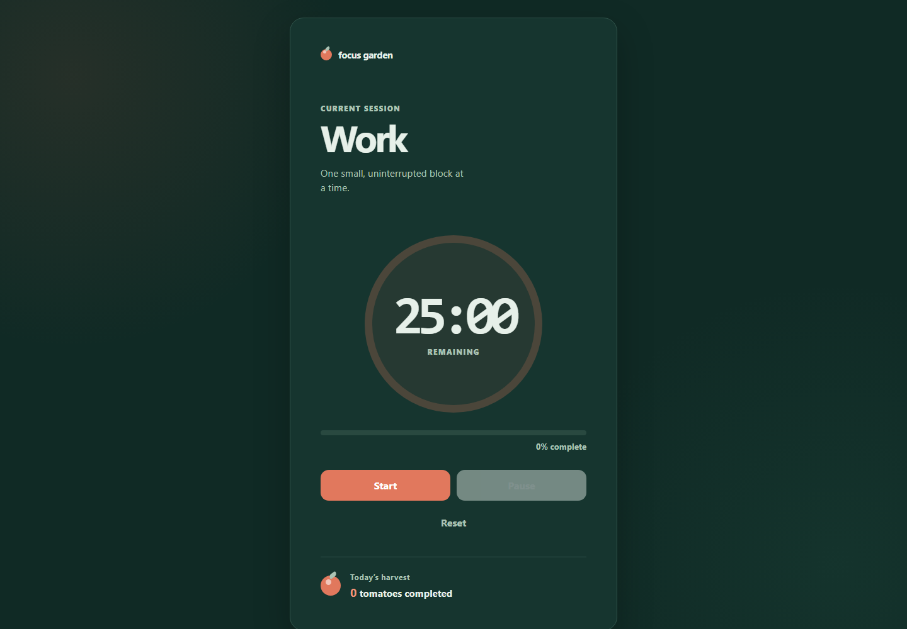
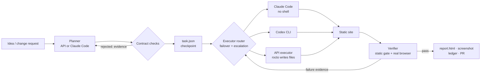

# Rainbow Octopus 🐙🌈

> A small engineering agent that turns one sentence into a **review-ready,
> automatically verified static web demo** — and keeps it that way as you
> change it.

Repository: <https://github.com/luminous-creator/Rainbow-Octopus>



<sub>`rocto build "做一个带统计功能的番茄钟网页"` — planned by DeepSeek, written by
the Codex backend after Claude Code was skipped for being signed out, then driven
in a headless browser: 31 assertions, [full report](demo-output/pomodoro-2/acceptance-report.json).
The whole run is kept in [`demo-output/pomodoro-2/`](demo-output/pomodoro-2/),
including [what that green report failed to catch](docs/KNOWN_ISSUES.md#ki-007--a-passing-contract-that-verified-almost-nothing--fixed).</sub>

Rainbow Octopus is not another general agent framework. It is a narrow,
observable workflow that runs start to finish without supervision:

```text
idea → task specification (checked, repaired) → the first available coding agent
     → deterministic checks in a real browser → repair, escalating to another
       model if the same one keeps failing → report.html + screenshot
```

It runs on Windows, macOS and Linux and deliberately does one kind of task:
a vanilla HTML/CSS/JavaScript page, built new or changed in place.

> **第一次用？看 [新手指南](docs/新手指南.md)** —— 不需要懂 AI，10 分钟从一句话到比赛材料。
> Windows 上直接双击 `start-windows.bat`。

## Quick start

```bash
pip install -e .
rocto doctor                         # what is installed, what to fix
rocto build "一个带今日完成次数统计的番茄钟网页"
rocto open                           # the report of the build you just ran
rocto kit                            # competition pack: 作品说明书, screenshots, source, Q&A
```

Or just run `rocto` with nothing after it: it asks what to build (in Chinese),
builds it, and offers to make the competition pack.

That is the whole loop. There is no output directory to choose (builds go to
`rocto-builds/<timestamp>-<slug>/`), and every follow-up command defaults to
the last build.

**What you need:** Python 3.10+, a Chromium-family browser (Chrome, Chromium,
Edge, Brave — or one Playwright installed), and **one** of:

- a signed-in [Claude Code](https://claude.com/claude-code) CLI — then no API
  key is needed at all; Claude Code plans and writes the page, or
- an API key for any OpenAI-compatible endpoint (`DEEPSEEK_API_KEY` by default).

`rocto doctor` tells you which of these it found and prints the one command
that fixes whatever is missing.

### Try it with no account and no CLI

The whole pipeline can be rehearsed offline. The two model calls are replaced by
fixed responses; the planner, the router, the executor boundary enforcement and
the verifier are the real code (and when a browser is installed, the page is
really driven in it):

```bash
python scripts/dry_run.py router
```

The `router` scenario simulates a signed-out Claude Code and a broken Codex, and
shows the failover picking DeepSeek.

## What a run looks like

```text
$ rocto build "做一个25分钟番茄钟网页，支持开始、暂停、重置，并显示今日完成次数"
[  0.3s] plan     asking Claude Code for a task specification
[ 29.8s] plan     5 contract elements, 14 assertions
[ 29.8s] contract 'completed-count' is only ever asserted as '0'; no test observes it change …
[ 29.8s] build    attempt 1/3 — writing the site
[ 65.0s] build    site written by claude
[ 65.0s] verify   checking files, contract, then driving a browser
[ 80.6s] done     22/22 checks passed

  PASS  25-Minute Pomodoro Timer — Works — every check passed
        22/22 checks passed · 1 attempt · written by claude · $0.12

  Not verified (a passing report does not cover these):
    - 'completed-count' is only ever asserted as '0'; no test observes it change …

  Report:  rocto-builds/20260926-070527-build/report.html
  Next:    rocto open rocto-builds/20260926-070527-build
```

That is a real run, on a Linux container with no API key and no configuration.
Then, to change it:

```text
$ rocto refine "增加一个“跳过”按钮：点击后立即结束当前番茄钟，完成次数加一"
[  0.3s] refine   revision 1: 增加一个“跳过”按钮 … (backup: rev-0)
[ 21.7s] plan     6 contract elements, 20 assertions
[ 48.6s] build    site written by claude
[ 69.9s] done     28/28 checks passed
```

The old tests stay in the contract, so the refine had to keep everything that
already worked; the new ones observe the counter change, so the "Not verified"
warning is gone. Had the change failed its checks, the previous version would
have been restored.

`report.html` is a single offline page: the verdict in plain words, the
screenshot, every check described as a step ("Click [start]", "[timer] shows
“25:00”"), what was **not** verified, and who wrote each attempt, how long it
took and what it cost.

## Commands

```text
rocto build IDEA   [-o DIR] [--planner auto|api|claude] [--executor auto|claude|codex|deepseek]
                   [--mode auto|cheap|best] [--max-retries 0..4] [--escalate-after N]
                   [--max-minutes M] [--max-cost-usd USD]
                   [--review-plan] [--spec task.json] [--open] [-q | --json-events]
rocto resume [DIR]            continue from the last checkpoint
rocto refine CHANGE [DIR]     change a passing build; rolls back if the change fails
rocto status [DIR]            state, attempts, and the next command to run
rocto report [DIR] [--format text|markdown|html]
rocto open [DIR] [--site]     open report.html (or the page)
rocto serve [DIR]             preview on http://127.0.0.1:8765
rocto kit [DIR] [--no-ai]     competition submission pack (see below)
rocto doctor                  prerequisites, with a fix for each failure
rocto config [show|set|unset|path]    rocto init    (writes a commented rocto.toml)
rocto stats                   pass rates, time and spend per executor, from every past build
rocto batch FILE              build a list of ideas unattended
rocto gallery DIR -o SITE     publish passing builds as one static site
```

`DIR` defaults to the last build everywhere.

| Exit code | Meaning |
| --- | --- |
| 0 | success |
| 2 | bad usage, unsafe output path, or nothing to act on |
| 3 | planning failed |
| 4 | generation or verification failed after retries (`rocto resume` continues) |
| 5 | stopped at `--max-minutes` / `--max-cost-usd` (`rocto resume` continues) |
| 6 | plan rejected at `--review-plan` |
| 130 | interrupted (`rocto resume` continues) |

### Nothing is lost when a build stops

Every stage ends in a checkpoint. Ctrl+C, a crash, a rate limit that outlasted
the retries, or a budget stop all leave a state that `rocto resume` continues:
the plan is not paid for again, a page that was written but never checked is
checked first, and attempt numbers keep counting so no log is overwritten.
Transient API failures (429, 5xx, timeouts) are retried with backoff before
anything is reported as failed.

### Unattended options

- `--json-events` prints one JSON object per event plus a final `result`
  object — for scripts and other agents. Every build also writes the same
  events to `.rocto/events.jsonl`.
- `--review-plan` shows the plan in words and asks **y / e(dit) / n** before any
  generation is paid for. Without a terminal it is skipped with a warning.
- `--spec task.json` builds from a specification you already have.

## Competition submission pack

`rocto kit` turns a passing build into what a student competition usually asks
for, in a folder next to the build (`<build>-kit/`):

| File | What it is |
| --- | --- |
| `作品说明书.md` / `.html` | project description; open the HTML in a browser and save as PDF |
| `截图/桌面版.png`, `截图/手机版.png` | desktop and phone screenshots |
| `源码.zip`, `源码/` | the source |
| `测试报告.html` | evidence: every automated check and its result |
| `答辩准备.md` | five questions judges are likely to ask, with honest answers |
| `提交清单.txt` | a checklist to go through before submitting |

The descriptions are written by one short model call (about 4k tokens, $0.02
with Claude; a fraction of a cent with DeepSeek), or by a built-in template
with `--no-ai`, at no cost. **Facts are never written by the model**: check
counts, test cases, what was not verified and who wrote the code come from the
build itself. Every pack contains an AI-use declaration, and the checklist
tells the student to check whether the competition allows AI tools at all.

## Cost

- `--mode cheap` puts the pay-per-token API backend first (about one cent per
  build with DeepSeek) and keeps subscription CLIs as fallbacks; `--mode best`
  puts Claude Code first.
- Every report shows the tokens and dollars each build used; `rocto stats`
  totals them.
- `rocto resume` re-checks a page that is already on disk before paying for a
  new one, and `rocto kit --no-ai` costs nothing.

## Executors

One requirement, three interchangeable coding agents. `--executor auto` (the
default) walks the list in order and skips anything that is not installed or
not signed in, so a build never dies because one vendor's CLI is broken on this
machine.

| Backend | Needs | Notes |
| --- | --- | --- |
| `claude` | Claude Code CLI, signed in | Runs with `--tools "Read,Write,Edit,Glob"`, so it has **no shell access at all**. Spend capped per attempt (`claude_budget_usd`, default $1.50). |
| `codex` | Codex CLI, signed in | Runs `codex exec --sandbox workspace-write`. Automatically retries once without Codex's sandbox if the Windows sandbox helper is missing (see KI-002). |
| `deepseek` | An API key only | One HTTPS call returns the four files as JSON; **rocto writes them itself**. Works with any OpenAI-compatible endpoint. |

**Escalation.** If the same backend's page fails verification twice in a row
(`--escalate-after`, default 2), the next repair goes to the next backend, with
the failure evidence. A different model is more likely to see what the first
one keeps missing.

**Which subscription gets spent.** Claude Code and Codex draw on a monthly
quota, so the order is configurable:

```bash
rocto config set executor_order "deepseek,codex,claude"   # save quota
rocto config set executor_order "claude,deepseek"         # best effort, e.g. for a demo
```

The planner is chosen the same way: `--planner auto` uses the API when a key is
set (cheap, no subscription quota) and Claude Code otherwise.

## Configuration

Every setting is an environment variable, and `rocto.toml` (in the working
directory) or the user config (`rocto config path`) can provide defaults for
them. An explicit environment variable or CLI flag always wins.

```bash
rocto init                              # commented rocto.toml with every setting
rocto config set max_retries 3          # user config
rocto config                            # every setting, its value, and where it came from
```

```toml
# rocto.toml
executor_order = "deepseek,claude"
max_minutes = 20
api_base = "https://openrouter.ai/api/v1"
api_key_env = "OPENROUTER_API_KEY"     # the NAME of the variable holding the key
model = "deepseek/deepseek-chat"
```

**API keys are never read from files** — `api_key = …` is rejected. Use
`ROCTO_API_KEY` / `DEEPSEEK_API_KEY`, or name your own variable with
`api_key_env`, so a config file is always safe to commit.

<details><summary>All environment variables</summary>

| Variable | Setting |
| --- | --- |
| `ROCTO_API_BASE`, `ROCTO_API_KEY`, `DEEPSEEK_API_KEY` | endpoint and key (any OpenAI-compatible `/chat/completions`) |
| `ROCTO_PLANNER` | `auto` \| `api` \| `claude` |
| `ROCTO_DEEPSEEK_MODEL`, `ROCTO_DEEPSEEK_CODER_MODEL` | API planner / executor model |
| `ROCTO_EXECUTOR`, `ROCTO_EXECUTOR_ORDER`, `ROCTO_ESCALATE_AFTER` | routing |
| `ROCTO_MAX_RETRIES`, `ROCTO_TIMEOUT`, `ROCTO_PLANNER_TIMEOUT` | attempts and timeouts |
| `ROCTO_MAX_MINUTES`, `ROCTO_MAX_COST_USD` | budgets |
| `ROCTO_OUTPUT_ROOT`, `ROCTO_OPEN` | where builds go; open the report when done |
| `ROCTO_BROWSER_BIN` (`ROCTO_EDGE_BIN`), `ROCTO_BROWSER_NO_SANDBOX` | browser |
| `ROCTO_CLAUDE_BIN`, `ROCTO_CLAUDE_MODEL`, `ROCTO_CLAUDE_BUDGET_USD`, `ROCTO_CODEX_BIN` | CLIs |
| `ROCTO_HOME` | user config, ledger and last-build pointer |

</details>

## Automation on GitHub

Three workflows turn the repository into a build service:

| Workflow | Trigger | Does |
| --- | --- | --- |
| `build-from-issue.yml` | label an issue **`rocto:build`** (or run it manually) | builds the issue's idea and opens a **pull request** with the page, screenshot and report; a failed build comments why on the issue |
| `pages.yml` | push to `main` under `builds/` | publishes every passing build as a gallery on GitHub Pages |
| `nightly.yml` | every night | runs the five benchmark ideas; fails if fewer than four pass |

Setup, once:

1. **Settings → Secrets and variables → Actions → New repository secret:**
   `DEEPSEEK_API_KEY` (or `ROCTO_API_KEY`, plus a `ROCTO_API_BASE` variable for
   another provider).
2. **Issues → Labels → New label:** `rocto:build`.
3. **Settings → Pages → Source: GitHub Actions** (for the gallery).
4. **Settings → Actions → General → Workflow permissions:** allow GitHub Actions
   to create pull requests.

Security: only someone with triage access can add a label, so opening an issue
cannot spend the key; issue text never reaches a shell; the job that runs
generated code has a read-only token, and the job that can push never runs
generated code. See ADR-009.

## Contract checks

Deterministic verification is only worth as much as the contract it verifies.
A build can pass every assertion and still not do what was asked, so the task
specification is checked before any code is written, and the planner gets its
failures — and its own rejected reply — back to repair.

Two rules block a specification:

- **No clock-shaped value asserted after a `wait`,** unless the same value is
  also asserted with no wait before it. Expecting `24:58` two seconds after
  starting a `25:00` timer does not test the timer; it is satisfied more
  cheaply by adjusting the tick rate than by building the clock correctly.
- **No `ui_contract` element that no test ever selects.** A declared, untested
  element reads as coverage that does not exist.

Every test is an independent case: it runs in a freshly loaded page with empty
localStorage and sessionStorage, so no test can pass or fail because of what an
earlier one left behind (KI-011).

One rule reports without blocking: an element whose assertions all expect the
same value appears under **Not verified** in the terminal, in `report.html` and
in pull requests. See KI-007 for the build that prompted all of this.

## Safety model

- Refuses filesystem roots, the user home directory, and non-empty outputs.
- **The four generated filenames are an allowlist.** For the API backend the
  model never touches the disk — it returns file contents and rocto writes
  them.
- **The Claude Code executor runs without the Bash tool**, and the Claude Code
  planner runs with no tools at all.
- Anything an agent leaves inside the output directory that is not part of the
  contract is deleted and recorded in the execution log.
- Protects `.rocto/task.json` against executor modification.
- Success is decided by what is on disk, never by an exit code.
- Accepts only seven browser-test actions and only exact `data-testid`
  selectors declared in the contract.
- Never executes model-generated shell or Python.
- Rejects external URLs and browser network APIs in generated source.
- **The browser never sees a credential:** it is started with every
  `*KEY*`/`*TOKEN*`/`*SECRET*` variable removed from its environment.
- Does not store API keys — not in config files, logs or the ledger (which
  stores only a hash of each idea).
- `refine` snapshots before changing anything and restores on failure.

## Architecture


```mermaid
flowchart LR
    U["Idea / change request"] --> P["Planner<br/>API or Claude Code"]
    P --> C{"Contract checks"}
    C -->|rejected: evidence| P
    C --> T["task.json<br/>checkpoint"]
    T --> R{"Executor router<br/>failover + escalation"}
    R --> CC["Claude Code<br/>no shell"]
    R --> CX["Codex CLI"]
    R --> DS["API executor<br/>rocto writes files"]
    CC --> W["Static site"]
    CX --> W
    DS --> W
    W --> V["Verifier<br/>static gate + real browser"]
    V -->|failure evidence| R
    V -->|pass| A["report.html · screenshot<br/>ledger · PR"]
```

## Development

The package has no third-party runtime dependencies.

```bash
PYTHONPATH=src:tests python -m unittest discover -s tests -v   # ";" on Windows
python scripts/dry_run.py all
python scripts/run_benchmarks.py        # the five frozen benchmarks, live services
```

## 当前边界

生成的仍然只是纯静态网页（HTML/CSS/JS 四个文件），不修改已有仓库，不控制
Claude/ChatGPT/Gemini 的网页版。多执行器路由是固定优先级 + 失败升级，不做基于历史
成功率的智能调度——`rocto stats` 已经开始积累这份数据，智能调度属于下一步。

## Status

KI-001 through KI-011 are fixed; see [`docs/KNOWN_ISSUES.md`](docs/KNOWN_ISSUES.md)
for each, and ADR-001 to ADR-009 for the decisions behind the design. The real
browser loop has been observed on Windows 11 with Edge and on Linux with
Chromium (including as root in a container); two live builds — a new site and a
refine of it — passed there with Claude Code as planner and executor. The GitHub
workflows pass `actionlint` and their build step has been rehearsed locally,
but they have not yet run on GitHub. Nothing is claimed that has not been
observed.

## License

MIT
